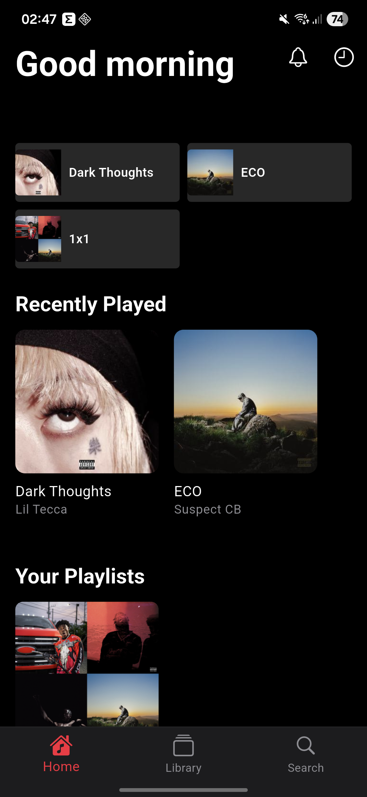
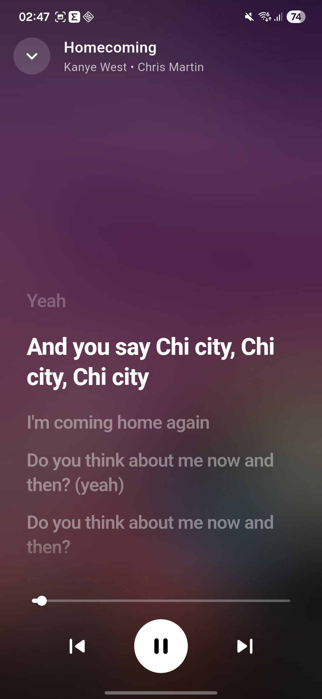
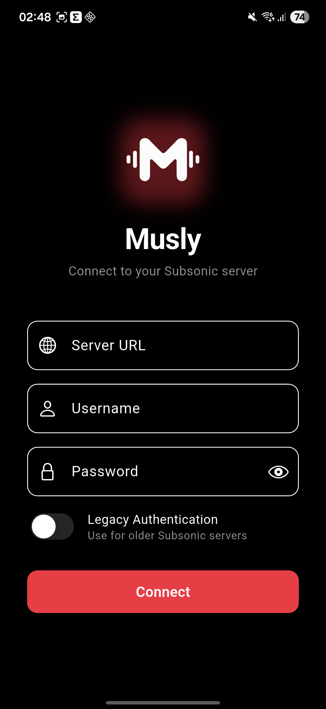

# Musly - Universal Music Streaming Player & Client

**Musly** is a free, modern, and elegant music player and streaming client. Stream your self-hosted music library from **Navidrome**, **Subsonic**, **Jellyfin**, **Emby**, or **Airsonic**, listen to live **Web Streams & Internet Radio**, or play **Local Music Files** directly from your device on Android, iOS, Windows, Linux, and macOS.

## GitAds Sponsored
[](https://gitads.dev/v1/ad-track?source=dddevid/musly@github)


🌐 **Website:** [musly.devid.lol](https://musly.devid.lol/)

[](https://github.com/dddevid/Musly/releases/tag/v2.0.2)
[](https://musly.devid.lol)
[](https://musly.devid.lol)
[](https://musly.devid.lol)
[](https://musly.devid.lol)
[](https://crowdin.com/project/musly)

## Why Choose Musly?

Musly is a versatile, high-performance music client offering:

- 🎵 **Multi-Source Streaming** - Stream seamlessly from Navidrome, Subsonic, Jellyfin, Emby, or Airsonic servers
- 📁 **Local Audio Files** - Play local music stored directly on your device storage
- 📻 **Live Web Streams & Internet Radio** - Search, browse, and listen to thousands of web radio stations worldwide
- 🎨 **Modern & Adaptive UI** - Sleek interface with Material 3 Dynamic Colors (Material You), smooth glassmorphism, and responsive layouts
- 🌙 **Dark/Light Mode** - Automatic theme switching based on system settings
- 📱 **Cross-Platform & Responsive** - Fully optimized for phones, tablets, foldables, and desktop computers
- 🎧 **Time-Synced Lyrics** - Synchronized lyrics with interactive tap-to-seek and desktop fullscreen mode
- 📡 **Casting & Remote Playback** - Stream audio directly to Google Cast, UPnP, and DLNA devices
- 🔀 **Smart Radio Queues & Auto-Refill** - Continuous automated queue replenishment based on your favorite tracks and artists
- 💾 **Offline Downloads** - Download tracks, albums, and playlists for offline high-fidelity listening
- 🚗 **Android Auto** - Full native Android Auto integration
- 📊 **Musly Wrapped & Statistics** - Personalized listening statistics, top genres, and yearly rewinds

### Prerequisites

- Flutter SDK 3.10.0 or higher
- A supported music source (Navidrome, Subsonic, Jellyfin, Emby, Web Stream, or Local Files)

## Supported Platforms

Musly is a cross-platform application that supports:
- 📱 **Android**
- 🍏 **iOS**
- 🪟 **Windows**
- 🐧 **Linux**
- 🍎 **macOS**

## Download Musly

You can download the latest release of Musly:
👉 **[Download Musly v2.0.2](https://github.com/dddevid/Musly/releases/tag/v2.0.2)**

## Community

Join our Discord community to get support, share feedback, and connect with other Musly users!

<div align="center">

[](https://discord.gg/k9FqpbT65M)

**[Join Discord Server](https://discord.gg/k9FqpbT65M)** 💬

</div>

## 💖 Support the Project

If you find Musly useful and want to support its development

| Network | Address |
| :--- | :--- |
| **Bitcoin (BTC)** | `bc1qrfv880kc8qamanalc5kcqs9q5wszh90e5eggyz` |
| **Solana (SOL)** | `E3JUcjyR6UCJtppU24iDrq82FyPeV9nhL1PKHx57iPXu` |
| **ETH / Monad / Hype** | `0x01195b0Ae97b2D461aB0C746663bFE915eb9ac7c` |

---

## Roadmap

- [x] **Custom PC UX**: Basic desktop layout with persistent sidebar and dedicated player bar.
- [x] **Desktop Lyrics & Fullscreen Mode**: Synced lyrics view with smooth scrolling and true fullscreen on desktop.
- [-] **CarPlay Support**: Add a dedicated browsing interface for CarPlay. (Carplay needs a signed certificate, until the app is available on the appstore carplay wont work, only if selfsigned and with carplay enabled in the code)
- [x] **Local Playlists**: Manage playlists locally, independent of the server.
- [x] **Jellyfin & Emby Support**: Native connection and streaming from Jellyfin and Emby media servers.
- [x] **Internet Radio & Web Streams**: Live radio stream exploration and playback.
- [x] **Local Files Support**: Direct playback and library indexing of device audio files.
- [ ] **Custom API Server**: Support for custom backend implementations and extended APIs.
- [x] **Improved Offline Sync**: Reliable background downloading and offline caching.
- [ ] **Tizen OS (Samsung TV) and WebOS (LG TV) Port**

## Screenshots

<p align="center">
  
  
  
  
</p>

## Installation

1. Install dependencies:
   ```bash
   flutter pub get
   ```
2. Run the app:
   ```bash
   flutter run
   ```

### Connecting to Your Music Source

1. Launch the app
2. Select your music source type:
   - **Subsonic / Navidrome**: Enter server URL, username, and password (toggle "Legacy Authentication" if needed)
   - **Jellyfin / Emby**: Enter server URL and credentials / API token
   - **Internet Radio**: Browse live stations and web streams directly
   - **Local Storage**: Grant storage permission to index and play local audio files
3. Tap "Connect" and enjoy your music!

## Translations

[](https://crowdin.com/project/musly)

Musly is translated into 27 languages! Help translate Musly into your language:

📝 **[Contribute on Crowdin](https://crowdin.com/project/musly)**

See [TRANSLATIONS.md](TRANSLATIONS.md) for a complete guide on how to contribute translations.

## Supported Music Sources & Servers

Musly works seamlessly across a wide variety of music sources:

- **Navidrome** - [navidrome.org](https://www.navidrome.org/)
- **Jellyfin** - [jellyfin.org](https://jellyfin.org/)
- **Emby** - [emby.media](https://emby.media/)
- **Subsonic** - [subsonic.org](http://www.subsonic.org/)
- **Airsonic / Airsonic-Advanced** - [airsonic.github.io](https://airsonic.github.io/)
- **Gonic** - [github.com/sentriz/gonic](https://github.com/sentriz/gonic)
- **Web Streams & Live Radio** (Radio Browser API & custom stream URLs)
- **Local Audio Files** (MP3, FLAC, AAC, WAV, OGG, OPUS, M4A)

## License

> [!IMPORTANT]
> **DO NOT redistribute this app to the Google Play Store or other commercial stores.**

This project is open source and available under the **Creative Commons Attribution-NonCommercial-ShareAlike 4.0 International (CC BY-NC-SA 4.0)** License. See the [LICENSE](LICENSE) file for details.

---

<div align="center">
  <sub>Made with  in Italy  by an Albanian developer </sub>
</div>

<br/>

<div align="center">

[](https://github.com/dddevid/Musly)

